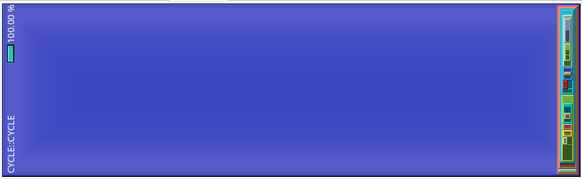
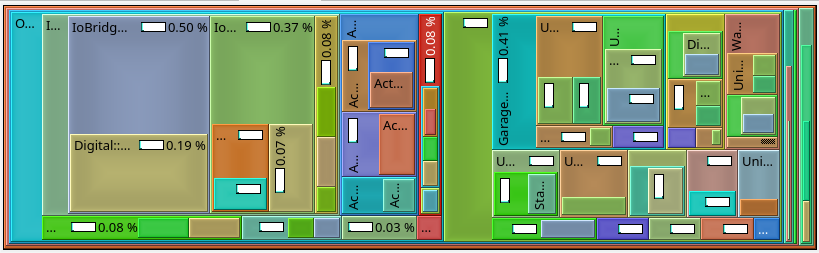

# Twingrind

This project aims to add simple profiling to TwinCAT PLCs. The general idea of the implementation is as follows.
1. Twingrind is a TwinCAT library that includes a program, which is used for profiling. It includes methods to built-up a callstack and some triggers to start profiling.
1. prepare.py is a python script that is used to add profiling boilerplate code to your PLC.
1. fetch.py can be used to read callstack from the PLC
1. reconstruct.py is used to convert the recorded callstacks to callgrind (http://kcachegrind.sourceforge.net/html/CallgrindFormat.html)

The profile can then be visualized by [qcachegrind](http://kcachegrind.sourceforge.net/html/Home.html). What follows is a short instruction how to use the code that is provided in this repository for profiling your PLC. The following image shows a visualization of the callstack of a single PLC cycle - Methodnames have been obfuscated

<p align="center">
  
</p>

The profiler can be set up to only capture callstacks of PLC cycles, which take "too long", which is adjustable by a threshold that is relative to the PLC cycletime. This feature is super handy for finding realtime violation issues where  the cycletime is exceeded.

The implementation is by no means feature complete and far from perfect. The core of the implementation was written way before TwinCAT offered any kind of profile mechanism, and I actually had the needs of a profile to find a serious problem in a PLC. Nowadays profiling for TwinCAT is offered by Beckhoff, but is of course attached with licencing fees and subpar visualization (my two cents). Twingrind instead uses a common fileformat for profiling and is free software. If you are interested to contribute to the project, feel free to write issues or fork the project and create pull requests. The current limitations of the profiler and the topics, which should be looked in, are as follows.

- [x] *Only methods are profiled, calls to function blocks are not implemented yet.* > Support for methods and functionblock calls and functions
- [ ] Only 1 task and 1 PRG are supported.
- [ ] Profiling itself adds some overhead to your code, which can not be avoided by this method, but maybe reduced by a fair bit.
- [x] *Calls in referenced PLC methods are not profiled and at the moment there is no way to add the profiling boilerplate code to PLC libraries, which are used by your PLC* > *prepare.py* can now be called for library plcs and the hashmap file can be reused
- [ ] No unicode character support in source files

## Backup

Before profiling you should backup your code by commiting it to your version-control system or at least copy&paste it to a different location. The script will modify your existing source code and although it has been tested thoroughly, it is always better to err on the side of caution.

## Install

Twingrind can either be downloaded from Github as or you can clone the [repository](https://github.com/stefanbesler/twingrind) and compile the library yourself. This guide will focus on the former use case.

First, [get the latest release](https://github.com/stefanbesler/twingrind/releases) of the Twingrind, the download will give you a file called "twingrind_0.1.1.0.compiled-library" and a python setup file. Note that the version number may differ from the file you actually downloaded. 

### Twingrind PLC library

Start the TwinCAT XAE Shell or the Visual Studio Version you are usually using to develop TwinCAT PLCs. Then, in the menubar, select **PLC** and then **Library Repository...** (see figures below)

<p align="center">
  &emsp;
  &emsp;
  
</p>

In the library-repository dialog, click on **Install** and navigate to the file compiled-library file and select it. Then, click on **Open** to install the struckig library into your TwinCAT environment, and you are ready to use it.

To make the Twingrind library available to the PLC, open the solution, which contains the PLC you want to profile. In the solution explorer, expand the PLC you are interested in and right-click on **References**. Select **Add library**. In the dialog, search for ***Twingrind***, then select the item and click on **Ok**

### pytwingrind python-module

Open a command prompt and navigate to the *pytwingrind-0.1.1-py3-none-any.whl* file. Then use the following command to install the python module on your system.
Make sure that your python environment is reachable in your path variable.

```
pip install pytwingrind-0.1.1-py3-none-any.whl
```

After running the command successfully, the executable `twingrind.exe` should be available in your path.

## Preparation

Most of the profiling boilerplate code is generated by the Twingrind command *prepare*. However, the following lines of code have to be added manually to your PLC's MAIN program.

```
Twingrind.Profiler();
Twingrind.Profiler.Push(0);

// <your existing implementation comes here>

Twingrind.Profiler.Pop(0);
```

The PRG *Profiler* has inputs to control the profiler, we will later add it to the watch window to control it. The methods *Push* and *Pop* are used for time measurements. Calling this method in the implementation of your main program is mandatory. After added the 3 lines of code, as shown above, use `twingrind.exe prepare` to add similar code section to all methods of your PLC.

```
twingrind prepare -d <PATH_TO_FOLDER_CONTAINING_PLCPROJ> -m <PATH_TO_HASHMAP_FILE>
```

The command transverses through the entire code base located at the given directory. For all methods it adds a similar call 
to the profiler in the header and the footer. The method calls are identified by id's and can be converted to readable 
strings by a hashmap file, which is the output of *prepare.py*. The file that is generated by this call is needed 
subsequently in *reconstruct*.

**Please make sure to use a directory containing your PLC**

## Using Twingrind

### Activate

You can now activate your PLC on your target and work as you are used to. Note that the Profiler adds some overhead to your code. making execution a bit slower. Usually you should not notice a big impact though. To start profiling navigate to your MAIN programm, right click on *Profiler* and `Add Watch`.

<p align="center">
  &emsp;
  
</p>

Then search for *Twingrind.Profiler* in the Watch panel and expand the node. You can then use the watch window to
- **Capture the callstack** of a single frame of your PLC by a rising edge of *CaptureOnce*
- Run **Captures continuously** by setting *CaptureContinuous=TRUE*. For this setting you can also specify a cpu time threshold such that only
  frames with a certain percentage-based usage of your CPU are captured.
- The library includes a parameter *MAX_FRAMES*, which is used to adjust the maximum amount of recorded frames. If *FrameIndex=MAX_FRAMES* no 
  new captures will be performed by the Profiler. In order to **reset already taken recordings** you can give a rising edge on *Reset*. This will 
  internally remove all data and set *FrameIndex=0* again.

### Process snapshot

The *process* command is a shortcut for *fetch* and then *reconstruct* every snapshot that was captured. Usually this is the command
that you want to work with.

```
twingrind process -m hashmap -t 1
```

Here `-m hashmap` refers to the hashmap that has been created for your PLC during preparation. `-t 1` means that the cycletime of your PLC
is *1ms*. Adapt these parameters accordingly to your setup, use `twingrind process -h` for a detailed listing of all arguments.

### Take snapshot

Run the following command to read out all data from your PLC. Note that recording has to be disabled before calling this issue. Disable
continous capturing by setting *CaptureContinuous=FALSE* in the watch window and then call

```
twingrind fetch
```

to read all recorded frames from the PLC. The resulting data is the output of *fetch* and is stored in 
the current directory. Latter files contain base64 encoded information about the callstack and can be 
converted to the callgrind format by *reconstruct*. The *fetch* command per default connects to the local target 
and with the PLC that is running on port 851. However, the command has several arguments to control its behavior, use
`twingrind fetch -h` for a detailed listing.


### Convert snapshot

Use the following command to reconstruct a frame.

```
python reconstruct -m <HASHMAPFILE> -c <CALLSTACK> -t 1
```

Creates a callgrind file in the current directory. This script uses a previously generated hashmap (output of *prepare*) together with a recorded callstack (output of *fetch*). 
Run the reconstruct command for all frames that were exported by *fetch. 
You may then open [qcachegrind](http://kcachegrind.sourceforge.net/html/Home.html) to visualize the callstack of your 
captured cycles. The command comes with some arguments to control its behavior, for details refer to `twingrind reconstruct -h`

In the images below the first one shows the overview over a complete cycle. The PLC that I was running when taking this picture didn't us a lot of cpu ticks that is why there is a lot of empty space in *CYCLE::CYCLE*. The second image is zoomed into the MAIN PRG.

In the images below the first one shows the overview over a complete cycle. The PLC that I was running when taking this picture didn't us a lot of cpu ticks that is why there is a lot of empty space in *CYCLE::CYCLE*. The second image is zoomed into the MAIN PRG.

<p align="center">
  &emsp;
    
</p>

## Cleanup

To cleanup your code from code that was added in the *Prepare* section you can run the *clean* as follows

```
twingrind clean -d <PATH_TO_FOLDER_CONTAINING_PLCPROJ> 
```

The command transverses through the entire code base of the plc located at the given directory. 
For all methods, the command removes the header function call and a the footer function call to the profiler 
library that were previously generated by using the "prepare".
