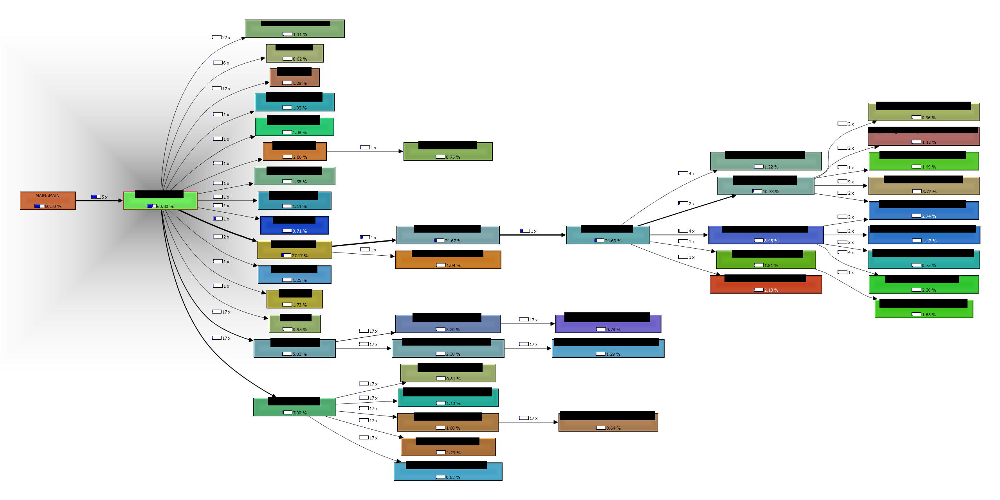

# tc3profiler




For now, Beckhoff's Twincat 3 doesn't offer any profiling mechanism. The scripts, implemented within the scope of this repository, aim to add such functionality in a relative simple way.
This project aims to add profiling of methods (of function blocks), rather than directly to function blocks. Coming from OOP I hardly use function blocks directly in my code base. 
Also, I focus on profiles of 1 cycle rather than profiling over a given timespan. Profiling is restricted to 1 Task and 1 PRG and visualization is implemented via callgrind. http://kcachegrind.sourceforge.net/html/Home.html

Currently this is work in progress, but the general idea is as follows

1. provide a simple profiler-library anyone can add to their application ( > ProfilerLib Twincat-3 library)
2. add function calls that are used for stack reconstruction for all methods in a given application. ( > prepare.py )
3. provide a script that triggers a profile measurement and then reads the callstack via ADS. The callstack is then stored on disk for later usage ( > fetch.py )
4. provide a script that reads a callstack (created by 3.) from disk and converts it to the callgrind profile format, version 1 (http://kcachegrind.sourceforge.net/html/CallgrindFormat.html) (process.py)

The profile can then be visualized by qcachegrind.

# using the profiler in your plc

## add library
wip

## generate profiling guards
use the script prepare.py to add guards to all methods in your plc

```
python prepare.py -d <PATH_TO_PLC> -a add -o ./
```
the script transverses through the entire code base of the plc located at the given directory. For all methods and it adds a header function call and a footer function call to the profiler library. The method calls are identified by id's and can be converted to readable strings by a hashmap file, which is generated by the script.

## make callstack snapshot
```
python fetch.py -n <NETID> -p 851 -d ./snapshots
```
triggers the profiler to start a measurment. Data generated by the profile is read via ADS and stored on disk. Optionally (-n) the stack currently stored within the PLC is (re-)read.

## generate callgrind file
```
python reconstruct.py -m <HASHMAPFILE> c <CALLSTACK> -d <CALLGRIND_OUTPUT_DIR>
```
creates a callgrind file in the directory given by the option -d. This script uses a previously generated hashmap (> generate profiling guards) together with a recorded callstack (> make callstack snapshot).

## removing profiling guards
use the script profiler_guards.py to remove guards to all methods in your plc

```
python prepare.py -d <PATH_TO_PLC> -a remove
```
the script transverses through the entire code base of the plc located at the given directory. For all methods, the script removes the header function call and a the footer function call to the profiler library that were previously generated by using the "add" command of the script
