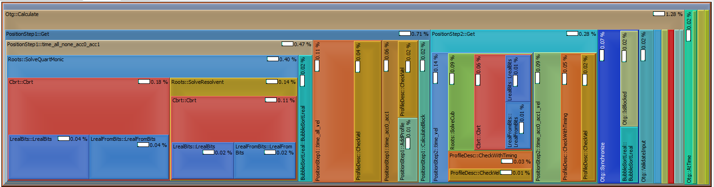
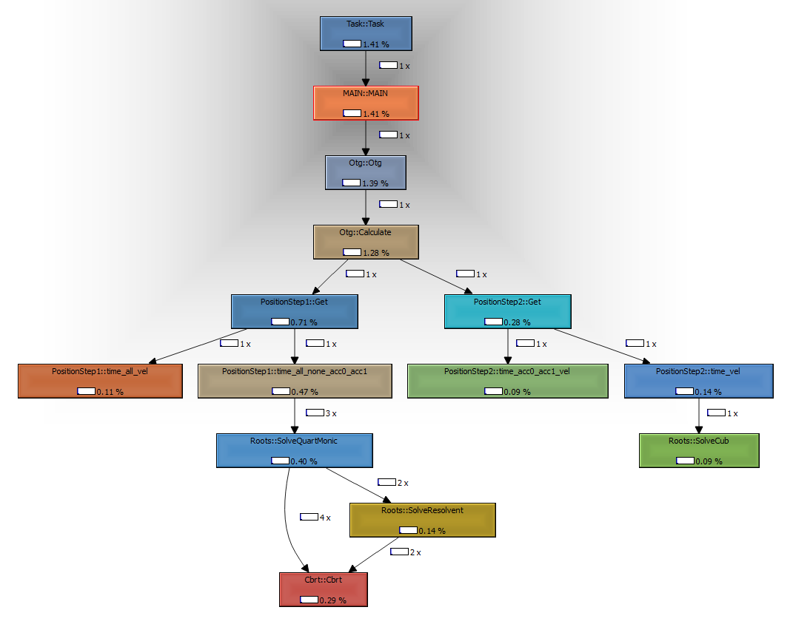

# Twingrind

This project brings profiling to TwinCAT PLCs. The general idea of this project is as follows.

1. Twingrind is a TwinCAT library that includes a program, which is used for profiling. It includes methods to built-up a callstack and some triggers to start profiling. To enable profiling for a PLC the library has to be added to your PLC and a call to the Profiler program it includes has to be made in the task that you want to profile.
1. pytwingrind a python script that is used to 
   - **prepare** your PLC for profile by adding some boilerplate code. This code are calls to `Push` and `Pop` methods of the Twincat library, which are needed to record the callstacks.
   - **fetch** previously recorded callstacks from the PLC and store it as binary data on our PC. This is not necessarily where the PLC is running.
   - **reconstruct** the recorded callstacks to callgrind (http://kcachegrind.sourceforge.net/html/CallgrindFormat.html) for visualization by [qcachegrind](http://kcachegrind.sourceforge.net/html/Home.html).
   
The following image shows a visualization of the callstack of example given in the [struckig project](http://github.com/stefanbesler/struckig) for the PLC cycle where the trajectory of the example is calculated. For this example, twingrind profiling was added to the struckig library and also to a PLC, which uses struckig.

<p align="center">
  
</p>
<p align="center">
  
</p>

## Features

- Profiling for TwinCAT PLCs with free software.
- Selective capturing of callstacks. Threshold can be used to adjust which callstacks should be stored by the profiler.
- Continuous profiling with the following modes
  - Only keep "slow" callstacks. This feature is super handy for finding realtime violation issues where the cycletime is exceeded.
  - Only keep "fast" callstacks, which is useful for finding issues with the baseline of your PLC.
  - Keep all callstacks, overwrite old callstacks in favour of new ones.
  - Only keep the first X callstacks.
- Profiling of distinct cycles.

The core of the implementation was written way before TwinCAT offered any kind of profile mechanism, and I actually had the needs of a profile to find a serious problem in a PLC. Nowadays profiling for TwinCAT is offered by Beckhoff, but is attached with licencing fees and is proprietary. Twingrind instead uses a common fileformat for profiling and is free software.

**If you are interested to contribute to the project, feel free to write issues or fork the project and create pull requests. I also appreciate [sponsoring](https://github.com/sponsors/stefanbesler) me for creating and maintaining this project.**

## Limitations

The current limitations of the profiler and the topics, which should be looked in, are as follows.

- [ ] Only PLCs that utilize exactly 1 task can be profiled.
- [ ] Profiling itself adds some overhead to your code, which can not be avoided by this method, but maybe reduced by a fair bit.


## Installation

Twingrind can either be downloaded from Github as or you can clone the [repository](https://github.com/stefanbesler/twingrind) and compile the library yourself. This guide will focus on the former use case.

First, [get the latest release](https://github.com/stefanbesler/twingrind/releases) of Twingrind, the download will give you a file called "twingrind_0.3.1.0.compiled-library" and a python setup file. Note that the version number may differ from the file you actually downloaded. 

### Twingrind PLC library

Start the TwinCAT XAE Shell or the Visual Studio Version you are usually using to develop TwinCAT PLCs. Then, in the menubar, select **PLC** and then **Library Repository...** (see figures below)

<p align="center">
  &emsp;
  &emsp;
  
</p>

In the library-repository dialog, click on **Install** and navigate to the file compiled-library file and select it. Then, click on **Open** to install the Twingrind-plc library into your TwinCAT environment, and you are ready to use it.

To make the Twingrind library available to the PLC, open the solution, which contains the PLC you want to profile. In the solution explorer, expand the PLC you are interested in and right-click on **References**. Select **Add library**. In the dialog, search for ***Twingrind***, then select the item and click on **Ok**

### pytwingrind python-module

Open a command prompt and navigate to the *pytwingrind-0.3.1-py3-none-any.whl* file. Then use the following command to install the python module on your system.
Make sure that your python environment is reachable in your path variable.

```
pip install pytwingrind-0.3.1-py3-none-any.whl
```

After running the command successfully, the executable `twingrind.exe` should be available in your path.

## Preparation


### Backup your source code

Before profiling you should backup your code by commiting it to your version-control system or at least copy & paste it to a different location. The script will modify your existing source code and although it has been tested thoroughly, it is always better to err on the side of caution.

### Prepare your source code

Most of the profiling boilerplate code is generated by the Twingrind command *prepare*. However, a call to Twingrind.Profiler() has
to be manually inserted as the **first line** of the **first PLC** in your task.

```
MAIN.PRG
-------------------------------
1 Twingrind.Profiler();
2
3 // <Already existing source code here>
4 // <Already existing source code here>
5 // <Already existing source code here>
.
.
```

The PRG *Profiler* has inputs to control the profiler, we will later add it to the watch window to control it. After added this 1 line of code, as shown above, use `twingrind.exe prepare` in the folder where your plcproj file is located, to add similar code to additional boilerplate code to your PLC.

```
twingrind prepare -d <PATH_TO_FOLDER_CONTAINING_PLCPROJ> -m <PATH_TO_HASHMAP_FILE>
```

The command transverses through the entire code base located at the given directory. For all calls it adds `Profiler.Push` and `Profiler.Pop` calls. The method calls are identified by id's and can be converted to readable 
strings by a hashmap file, which is the output of `twingrind prepare`. The file that is generated by this call is needed subsequently in *reconstruct*.

If you are using PLC libraries you can reuse the hashmap file and enabling profiling for your libraries as well by a similar call to `twingrind prepare`.

**Please make sure to use a directory containing your PLC**

## Usage

### Activate

You can now activate your PLC on your target and work as you are used to. Note that the Profiler adds some overhead to your code. making execution a bit slower. Usually you should not notice a big impact though. To start profiling, login to your PLC, navigate to your MAIN programm, right click on *Profiler* and `Add Watch`.

<p align="center">
  &emsp;
  
</p>

Then search for *Twingrind.Profiler* in the Watch panel and expand the node. You can then use the watch window to
- **Capture the callstack** of a single frame of your PLC by a rising edge of *CaptureOnce*
- Run **Captures continuously** by setting *CaptureContinuous=TRUE*.
  - You can specify a cpu time threshold such that only frames with a certain percentage-based usage of your CPU are captured (`CaptureCpuTimeLowThreshold`, `Capture CpuTimeHighThreshold`).
  - You can use `Mode` to adjust which callstacks are stored by the Profiler. For instance setting `Mode=Slowest` will only keep the slowest callstacks in the storage.
- The library includes a parameter *MAX_FRAMES*, which is used to adjust the maximum amount of recorded frames. If *FrameIndex=MAX_FRAMES* no 
  new captures will be performed by the Profiler. In order to **reset already taken recordings** you can give a rising edge on *Reset*. This will 
  internally remove all data and set *FrameIndex=0* again.

### Process snapshot

The *process* command reads all callstacks that have been recorded from the PLC and then reconstructs a callgrind file. Usually this is the command that you want to work with.

```
twingrind process -m hashmap
```

Here `-m hashmap` refers to the hashmap that has been created for your PLC during preparation. Use `twingrind process -h` for a detailed listing of all arguments.

### Optional: Only read out profiling data from the PLC

Run the following command to only read out all data from your PLC.

```
twingrind fetch
```

to read all recorded frames from the PLC. Capturing of callstacks is temporarily disabled. The resulting data is the output of *fetch* and is stored in 
the current directory. Latter files contain base64 encoded information about the callstack and can be 
converted to the callgrind format by *reconstruct*. The *fetch* command per default connects to the local target 
and with the PLC that is running on port 851. However, the command has several arguments to control its behavior, use
`twingrind fetch -h` for a detailed listing.


### Optional: Convert previously read out data to callgrind

Use the following command to reconstruct a frame.

```
python reconstruct -m <HASHMAPFILE> -c <CALLSTACK>
```

Creates a callgrind file in the current directory. This script uses a previously generated hashmap (output of *prepare*) together with a recorded callstack (output of *fetch*). 
Run the reconstruct command for all frames that were exported by *fetch*. 
You may then open [qcachegrind](http://kcachegrind.sourceforge.net/html/Home.html) to visualize the callstack of your 
captured cycles. The command comes with some arguments to control its behavior, for details refer to `twingrind reconstruct -h`

In the images below the first one shows the overview over a complete cycle. The PLC that I was running when taking this picture didn't use a lot of cpu ticks that is why there is a lot of empty space in *CYCLE::CYCLE*. The second image is zoomed into the MAIN PRG.

<p align="center">
  &emsp;
    
</p>

## Cleanup

To cleanup your code from code that was added in the *Prepare* section you can run the *clean* as follows

```
twingrind clean -d <PATH_TO_FOLDER_CONTAINING_PLCPROJ> 
```

The command transverses through the entire code base of the plc located at the given directory. 
For all methods, the command removes the header function call and a the footer function call to the profiler 
library that were previously generated by using the "prepare".
