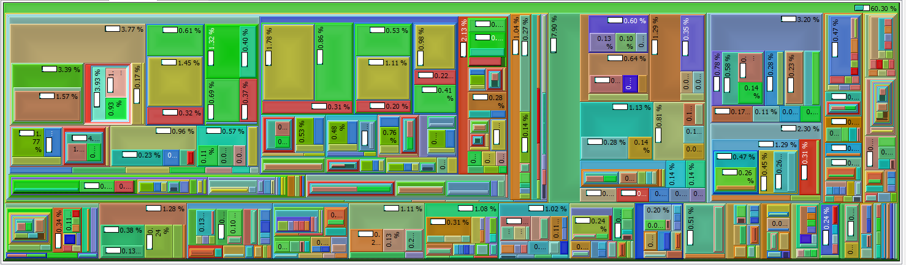
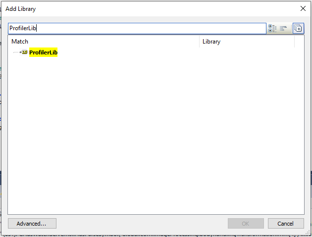
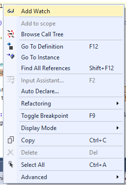
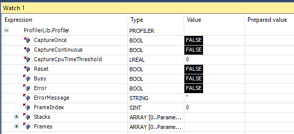

# Twingrind

The scripts, implemented within the scope of this repository, aim to simple profiling to TwinCAT PLCs. The general idea of the implementation is as follows.
1. Twingrind is a TwinCAT library that includes a program, which is used for profiling. It includes methods to built-up a callstack and some triggers to start profiling.
1. prepare.py is a python script that is used to add profiling boilerplate code to your PLC.
1. fetch.py can be used to read callstack from the PLC
1. reconstruct.py is used to convert the recorded callstacks to callgrind (http://kcachegrind.sourceforge.net/html/CallgrindFormat.html)

The profile can then be visualized by [qcachegrind](http://kcachegrind.sourceforge.net/html/Home.html). What follows is a short instruction how to use the code that is provided in this repository for profiling your PLC. The following image shows a visualization of the callstack of a single PLC cycle - Methodnames have been obfuscated

<p align="center">
  
</p>

The profiler can be set up to only capture callstacks of PLC cycles, which take "too long", which is adjustable by a threshold that is relative to the PLC cycletime. This feature is super handy for finding realtime violation issues where  the cycletime is exceeded.

The implementation is by no means feature complete and far from perfect. The core of the implementation was written way before TwinCAT offered any kind of profile mechanism and I actually had the needs of a profile to find a serious problem in a PLC. Nowadays profiling for TwinCAT is offered by Beckhoff, but is of course attached with licencing fees and subpar visualization (my two cents). Twingrind instead uses a common fileformat for profiling and is free software. If you are interested to contribute to the project, feel write issues or fork the project and create pull requests. The current limitations of the profiler and the topics, which should be looked in, are as follows.

- Only methods are profiled, calls to function blocks are not implemented yet.
- Only 1 task and 1 PRG are supported.
- Profiling itself adds some overhead to your code, which can not be avoided by this method, but maybe reduced by a fair bit.
- Calls in references PLC methods are not profiled and at the moment there is no way to add the profiling boilerplate code to PLC libraries, which are used by your PLC.

## Add library

The Twingrind PLC library can either be downloaded from Github as a [precompiled library](https://github.com/stefanbesler/twingrind/releases), or you can clone the [repository](https://github.com/stefanbesler/twingrind) and compile the library yourself. This guide will focus on the former usecase.

First, [get the latest release](todo) of the library, the download will give you a file called "twingrind_2.0.0.2.compiled-library". Note that the version number may differ from the file you actually downloaded. Start the TwinCAT XAE Shell or the Visual Studio Version you are usually using to develop TwinCAT PLCs. Then, in the menubar, select **PLC** and then **Library Repository...** (see figures below)

<p align="center">
  &emsp;
  &emsp;
  
</p>

In the library-repository dialog click on **Install** and navigate to the file compiled-library file and select it. Then, click on **Open** to install the struckig library into your TwinCAT environment and you are ready to use it.

To make the Twingrind library available to the PLC, open the solution, which contains the PLC you want to profile. In the solution explorer expand the PLC you are interested in and right-click on **References**. Select **Add library**. In the dialog search for ***Twingrind***, then select the item and click on **Ok**

## Prepare

Next, add the following code to your MAIN program

```
Twingrind.Profiler();
(* @@ PROFILER @@ *)Twingrind.Profiler.Push(0);(* @@ PROFILER @@ *)

// <your existing implementation comes here>

(* @@ PROFILER @@ *)Twingrind.Profiler.Pop(0);(* @@ PROFILER @@ *)
```

Then use `prepare.py` to add similar code section to all methods of your PLC.

```
python prepare.py -d <PATH_TO_PLC> -a add -o ./
```

The script transverses through the entire code base of the plc located at the given directory. For all methods and it adds a header function call and a footer function call to the profiler library. The method calls are identified by id's and can be converted to readable strings by a hashmap file, which is generated by the script.


## Activate

You can now activate your PLC on your target and work as you are used to, note that the Profiler adds some overhead to your code. making execution a bit slower. Usually
you should not notice a big impact though. To start profiling navigate to your MAIN programm, right click on *Profiler* and `Add Watch`.

<p align="center">
  &emsp;
  
</p>

Then search for *Twingrind.Profiler* in the Watch panel and expand the node. You can use the watch window to
- Capture the callstack of a single frame of your PLC by a rising edge of *CaptureOnce*
- Run Captures continuously by setting *CaptureContinuous=TRUE*. For this setting you can also specify a cpu time threshold such that only
  frames with a certain percentage-based usage of your CPU are captured.
- The library includes a parameter *MAX_FRAMES*, which is used to adjust the maximum amount of recorded frames. If *FrameIndex=MAX_FRAMES* no 
  new captures will be performed by the Profiler. In order to reset already taken recordings you can give a rising edge on *Reset*. This will 
  internally remove all data and set *FrameIndex=0* again.


## Take snapshot

Run the following script to read out all data from your PLC. Note that recording should be disabled before calling this issue. Disable
continous capturing by setting *CaptureContinuous=FALSE*. Then call

```
python fetch.py -n <NETID> -p 851 -d <SNAPSHOT_OUTPUT_DIR>
```

to get all recorded frames and store them in the *SNAPSHOT_OUTPUT_DIR* directory.


## Convert snapshot

Use the following script to reconstruct a frame.

```
python reconstruct.py -m <HASHMAPFILE> -c <CALLSTACK> -d <CALLGRIND_OUTPUT_DIR>
```

Creates a callgrind file in the directory given by the option -d. This script uses a previously generated hashmap (> generate profiling guards) together with a recorded callstack (> make callstack snapshot).

## Cleanup

To cleanup your code from code that was added in the *Prepare* section you can run the *prepare* script as follows

```
python prepare.py -d <PATH_TO_PLC> -a remove
```

The script transverses through the entire code base of the plc located at the given directory. For all methods, the script removes the header function call and a the footer function call to the profiler library that were previously generated by using the "add" command of the script
